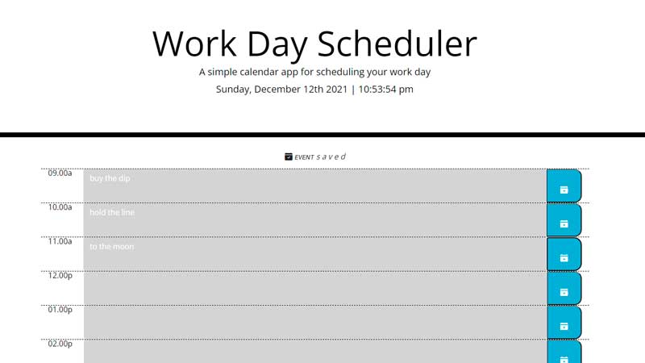

# Work Day Scheduler README
challenge 05 by <a href="https://github.com/escowin">Edwin Escobar</a>

Live URL:
https://escowin.github.io/challenge-05

GitHub Repo:
https://github.com/escowin/challenge-05

Following the challenge prompts:

_presents time blocks inline with standard business hours.
_relative to now, time blocks are color-coded to indicate past, present, or future.
_clicking on time block allows an event to be entered.
_clicking on the save button saves event to local storage.
_refreshing page loads & displays saved events.

bonus:
_saving event also triggers a two second "event saved" text to display for the user after clicking the save button.